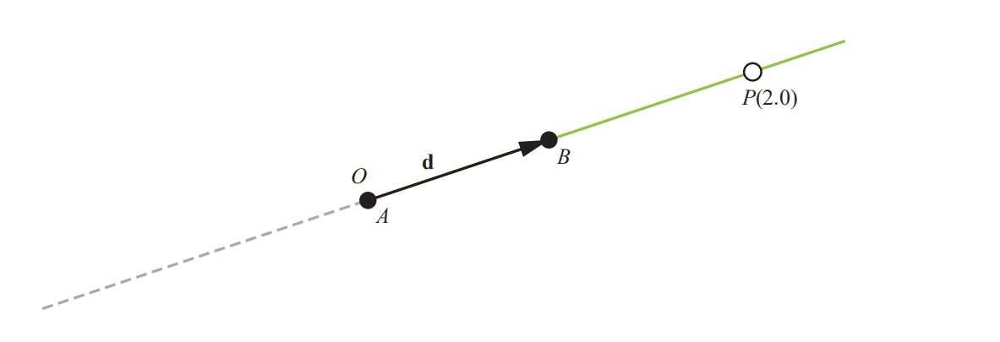
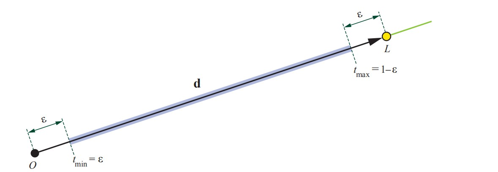

# <center>什么是光线</center>
<center>*Peter Shirley, Ingo Wald, Tomas Akenine-Möller, and Eric Haines*</center>
<center>翻译：GaoYanFei</center>
## 摘要

本章我们来定义光线、展示如何使用光线间隔，并且演示如何使用DirectX Raytracing(DXR)定义一根光线。
## 2.1 光线的数学表示
对于光线追踪技术来说，一个可计算的三维光线结构非常重要。不论在数学还是光线追踪技术中，一根光线通常指的是三维的射线。对于三维直线来说没有一个类似于二维直线$y=mx+b$的隐式方程。所以，通常我们需要使用到参数形式。（在这一章，所有的线、点和向量都是三维的。）
一个参数形式的线可以表示为两个点A,B的加权平均值。
$$P(t)=(1-t)A+tB \tag{2.1}$$


                                                                         <center>图2.1</center>

在程序中，我们可以将这种表示方法看做一个函数$P(t)$，它拥有一个实数输入t,并且返回一个点$P$。对于整条线来说，参数式可以输入任意实数，$t\in [-\infty,\infty]$,并且，随着t的变化，点P沿着线连续移动，如图2.1.
为了去实现这个函数，我们需要一种表示点A和B的方式。它们可以在任意的坐标系中，但是几乎大都是位于笛卡尔坐标系。在API和编程语言中，这个表示方法通常是*vec3*或者*float3*并且包含三个实数，x,y,z.同一条直线能够被直线上任意两个点所表示。但是选择不同的点，会改变t的值。


                                                                        <center>图2.2</center>

通常我们使用一个点与一个方向向量的形式，而不是两个点。如图2.2，我们能选择我们的光线方向**d**为$B-A$,并且，我们的原点*O*作为点A，得到

$$P(t)=O+td$$

由于各种各样的原因，在程序的实践过程中，人们发现对于通过点积来计算向量之间的余弦来说，限制的**d**为单位向量$\hat{d}$是非常有用的，*normalized*.归一化方向向量的结果是t可以直接表示距离原点的有符号距离。 更一般地，任何两个t值的差值就是两点之间的实际距离。

$$||P(t_{1}-P(t_{2})||=|t2-t1| \tag{2.3}$$

对于一般的向量**d**,这个公式应该乘以**d**的长度

$$||P(t_{1}-P(t_{2})||=|t2-t1|||d|| \tag{2.4}$$

## 2.2 光线间隔
根据方程2.2的光线公式，我们脑海中想象的光线画面是一条无限长的线。然而，在光线追踪中，光线几乎一直伴随着额外的间隔:t值的范围.通常我们使用两个值 
$t_{min}$和$t_{max}$来决定这个间隔，这就使得$t\in [t_{min},t_{max}]$.换句话说,如果交点的t在这两个之间，说明找到了解，如果小于$t_{min}$，大于$t_{max}$,则不会记录,见下图


                                                                         <center>图2.3</center>
当命中的结果超过给出的最大距离的时，本次命中是不重要的，比如对于阴影射线。假设我们有着色点P，并且想要询问它对于灯L的可见性。我们创建一个阴影射线，原点O=P，非标准化的方向向量$d=L-P$,$t_{min}=0$并且$t_{max}=1$.如果交点t在[0，1],光线与阻挡光线的几何体相交。在实践中，我们通常让$t_{min}=\epsilon$,$t_{max}=1-\epsilon$，$epsilon$是一个小的值。这种调整帮助避免由于数值精度不够所造成的自相交；使用浮点值进行数学运算时，P所在的表面可能会在一个小的非零值t时，与光线相交。 对于非点光源，光源主体不应遮挡阴影射线，因此我们使用$t_{max}=1-\epsilon$来缩短间隔。 如果使用完美的数学解决方案，忽略t = 0和1的交点，将取值区间转为开区间，这个问题就被很好的解决了。由于浮点精度有限，使用$epsilon$因子是一种常见的解决方案。有关如何避免自交的更多信息，请参见第6章

在实践中我们使用标准化的光线方向向量，我们使得O=P,
$\frac{L-P}{||L-P||}$,$t_{min}=\epsilon$,$t_{max}=l-\epsilon$,在这里，$l=||L-P||$是到光源的距离。请注意，这个epsilon必须不同于以前的epsilon，因为t现在有一个不同的范围。

一些渲染器使用单位长度向量来表示全部或部分光线的方向。这样做可以通过点积与其他单位向量进行有效的余弦计算，除了使代码更具可读性之外，它还可以使对代码进行推理变得更容易。如前所述，单位长度意味着射线参数t可以被解释为一个距离，而无需按方向向量的长度进行缩放，在任何情况下，实例的几何体都可以使用各自实例的转换来表示。然后，Ray/Object交集需要将光线转换到它们的对象空间，这将更改方向向量的长度。为了在这个新空间中正确地计算t，这个变换的方向应该保持非规范化。此外，规范化会花费一点性能，而且对于阴影光线可能是不必要的。由于这些优缺点的存在，所以关于是否应该使用单位方向向量没有一个准确建议。

## 2.3 DXR中的光线
在这个部分，我们展示 DirectX Raytracing [^ 3]中的光线的定义。在DXR，光线具有下面的数据结构：
```
    struct RayDesc
    {
        float3 Origin;
        float TMin;
        float3 Direction;
        float TMax;
    };
```
在DXR中处理不同光线类型的方式也是不同，其中某个着色器程序与每种不同类型的光线相关联。 要使用DXR中的`TraceRay()`函数跟踪光线，需要`RayDesc`。 `RayDesc::Origin`设置为光线的原点O，`RayDesc :: Direction`设置为光线方向d，并且t-interval（`RayDesc :: TMin`和`RayDesc :: TMax`）也必须初始化。 例如，对于眼睛光线（`RayDesc eyeRay`），我们设置`eyeRay.TMin = 0.0`和`eyeRay.TMax = FLT MAX`，这表示我们对原点前面的所有光线交点感兴趣。


## 2.4	总结
本章介绍了在光线跟踪器如何中定义和使用光线，并给出了DXR API的光线定义作为一个例子。 这和其他射线追踪系统，如OptiX [^ 1]和Vulkan射线追踪扩展[^ 2]有着细微的不同。 例如，OptiX明确定义了光线类型，例如阴影光线（shadow ray）。 这些系统具有其他共性，例如射线有效负荷（ray payload）的概念。 这是一种数据结构，用户可以定义这个数据结构来携带附加信息以及可由单独的着色器或模块访问和编辑的光线。 这些数据具有特定的应用。 每个定义了光线的渲染系统中，作为核心您将找到光线的原点，方向和间隔。

## References
[^ 1]NVIDIA. OptiX 5.1 Programming Guide. http://raytracing-docs.nvidia.com/optix/guide/index.html, Mar. 2018.

[^ 2]Subtil, N. Introduction to Real-Time Ray Tracing with Vulkan.	NVIDIA
Developer Blog, https://devblogs.nvidia.com/vulkan-raytracing/, Oct. 2018.

[^ 3]Wyman, C., Hargreaves, S., Shirley, P., and Barre-Brisebois, C.´ Introduction to DirectX RayTracing. SIGGRAPH Courses, Aug. 2018.
