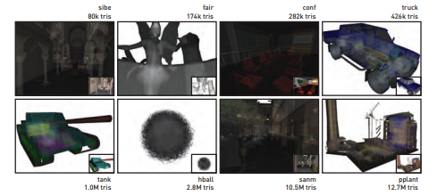

9.2节介绍了在DXR中实现多重命中光线追踪的几种方案. 这里, 我们将在一个GPU光线追踪示例程序中探索他们的性能. 

图9-2 用于性能评估的场景. 八个具有不同几何结构和深度复杂度的场景用于评估基于DXR实现的多重命中光线追踪实现. 许多场景的首次命中表面视图显著隐藏了内部的复杂性, 使得他们在测试多重命中遍历的性能时特别有用.

此应用程序的源代码的二进制发布已公开[4], 允许读者自行探索, 修改或者改进这些多重命中的实现.