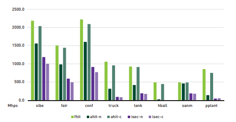
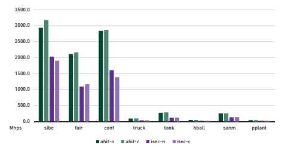

我们使用如图9-2所示的视角来渲染八个具有不同几何结构和深度复杂度的场景并报告性能. 对于每个测试, 我们在1280x960的分辨率上从一个针孔摄像机为起点发出光线并且每个像素一次采样, 先渲染50帧预热, 随后渲染500帧. 报告的结果在500个基准测试上取平均值. 测试在一个Windows 10 RS4 PC上进行, PC配备单个NVIDIA GTX 2080 Ti GPU (驱动版本416.71). 我们的应用程序使用Microsoft Visual Studio 2017 Version 15.8.9进行编译并链接到Windows 10 SDK 10.0.16299.0 和 DirectX Raytracing Binaries Release V1.3.
在本节其余部分引用的图中, 我们使用以下缩写来表示特定的遍历实现.
 - fhit: 标准的首次命中光线遍历的直接实现.
 - ahit-n: 简单地使用any-hit着色器实现的多重命中光线遍历
 - ahit-c: 使用any-hit着色器实现的节点剔除的多重命中光线遍历
 - isec-n: 简单地使用intersection着色器实现的多重命中光线遍历
 - isec-c: 使用intersection着色器实现的节点剔除的多重命中光线遍历

图9-3 用于查找第一个相交点的标准首次命中和多重命中的变体的性能. 该图比较了当Nquery = 1时标准首次命中和我们实现的多重命中之间的性能差异, 单位百万次命中每秒(millions of hits per second, Mhps).

阐释结果时请参考这些定义.
###### Find First Intersection
首先, 我们专门测量多重命中光线遍历相对于首次命中遍历的性能. 如图9-3比较了使用标准首次命中遍历和使用多重命中遍历找到最新的相交点(即Nquery = 1)时的性能, 单位百万次命中每秒(millions of hits per second, Mhps). 在这种情况下, 节点剔除的优势显而易见. 使用any-hit着色器实现的节点剔除多重命中BVH遍历的性能接近标准首次命中遍历(平均约在94%以内). 然而, 使用intersection着色实现的节点剔除变体总体上表现最差(平均超出4倍), 基本的多重命中遍历实现平均比首次命中遍历差2-4倍在我们的测试场景中.
###### Find All Intersections
接下来, 我们专门测量多重命中光线遍历相对于所有命中遍历(Nquery = ∞)的性能. 如图9-4比较了使用多重命中变体收集沿光线的所有相交点的性能, 单位Mhps. 毫无意外, 使用不同着色器实现的基本的节点剔除变体们表现基本一致, 差异基本都在预期的范围内.
###### Find Some Intersections
最终, 我们使用Gribble [3]考虑的Nquery值来测量多重命中的性能, 除了极值Nquery = 1和Nquery = ∞之外, 还包括每个场景下沿每条光线产生的相交点的最大值的10%, 30%和70%. 鉴于多重命中遍历在这种情况下无法专门用于首次命中或所有命中, 所以Find Some Intersections可能是最有意思的情况. 为了简洁起见, 我们仅检查卡车场景的结果, 但是这些结果中呈现的趋势也可以在其他场景中体现.

图9-4 多重命中变体用于查找所有相交点的性能. 该图比较了当Nquery = ∞时基本首次命中和节点剔除多重命中之间的性能差异, 单位Mhps.

图9-5显示了当Nquery → ∞时卡车场景的性能. 通常来说, 节点剔除实现下的影响相较其他实现而言更不明显. 例如, 参见Gribble [3]和Gribble等人报道的结果[6]. 使用any-hit着色器实现的情况下, 节点剔除对于性能的正面影响会随着Nquery = 1到Nquery = ∞减少, 从2倍到零. 虽然如此, any-hit着色器实现的节点剔除总体上表现最好, 通常比基本的实现好很多(至少不会更差). 与此相反, 使用intersection着色器的实现在Nquery值不同的情况下表现相似, 并且两种变体实现都比any-hit的实现要显著更差.