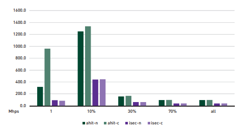
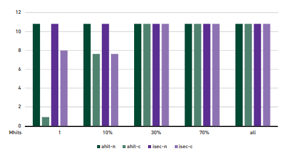
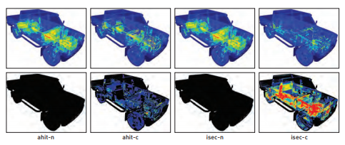

为了更好地理解上述结果，我们在图9-6中报告了各种多重命中遍历处理的候选相交点总数. 我们看到, 正如预期的那样, 无论Nquery的值是多少, 基本的多重命中实现都会处理相同数量的相交点. 同样, 我们看到节点剔除事实上减少了处理的候选相交点的总数, 至少在Nquery小于30％时. 然而, 在那之后, 两个节点剔除实现都处理与基本多重命中实现相同数量的候选相交点.  超过这个30％的阈值, 在我们的测试平台和场景上节点剔除对于基本的多击中遍历没有特别的优势.

图9-5 卡车场景中多重命中的性能. 该图比较了多个Nquery值情况下我们实现的多重命中算法变体之间的性能差异, 单位Mhps.

图9-6 图示的是卡车场景中处理的候选相交点的数量. 该图比较了不同多重命中实现处理的候选相交点数量, 单位百万.

图9-7 效率的可视化热度图. 使用彩虹色表揭示出节点剔除的光线遍历要比基本的光线遍历实现必须完成的工作少得多, 在Nquery = 9的情况下(第一行). 然而, 当比较节点剔除变体时, 由更少的遍历步骤和光线/基元相交测试带来潜在的性能提升被显著增加的光线间隔的更新所抵消了. 在这种情况下花费的成本超过了节省的性能.

图9-6中的数据还表明, 使用any-hit着色器变体丢失某些剔除节点的机会(如第9.2节所述)并不会影响实际中的整体遍历行为. 实际上, 当整体观察三个实验的性能时, 我们可以看到无论Nquery的值是多少, any-hit着色器实现的节点剔除性能都要比intersection着色器实现的性能要高出平均2倍.
尽管使用DXR机制下的用户自定义的(或内置的)几何结构进行光线/三角形求交出现的效率低下可能导致节点剔除实现之间的性能差距很大, 但图9-7中的可视化视图提供了一些额外的见解. 顶行描绘了每个多重命中实现变体在Nquery = 9时处理的候选相交点的数量, 或是沿一条光线产生最大命中数的10%. 而底行描述了每个实现调用的更新光线间隔的次数. 正如所料, 这和基本的多重遍历实现是等效的. 它们处理相同的候选相交点总数, 并且不进行任何光线间隔更新. 类似的, 两个节点剔除变体都减少了处理的候选相交点的数量, 使用DXR intersection着色器的实现会产生比any-hit着色器实现更少的变体(7.6M 对比 8.5M). 然而, DXR intersection的实现引入了更多的间隔更新(1.7M 对比 837k). 这些更新操作是两个实现之间用户执行代码过程的主要差异. 因此, 在DXR中, 使用intersection着色器实现剔除引入了更多的工作相比于剔除本身节省掉的工作, 并因此导致在整体性能上产生客观的差异.
