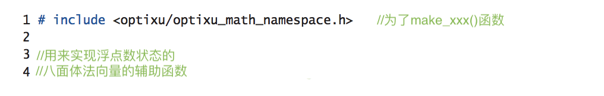
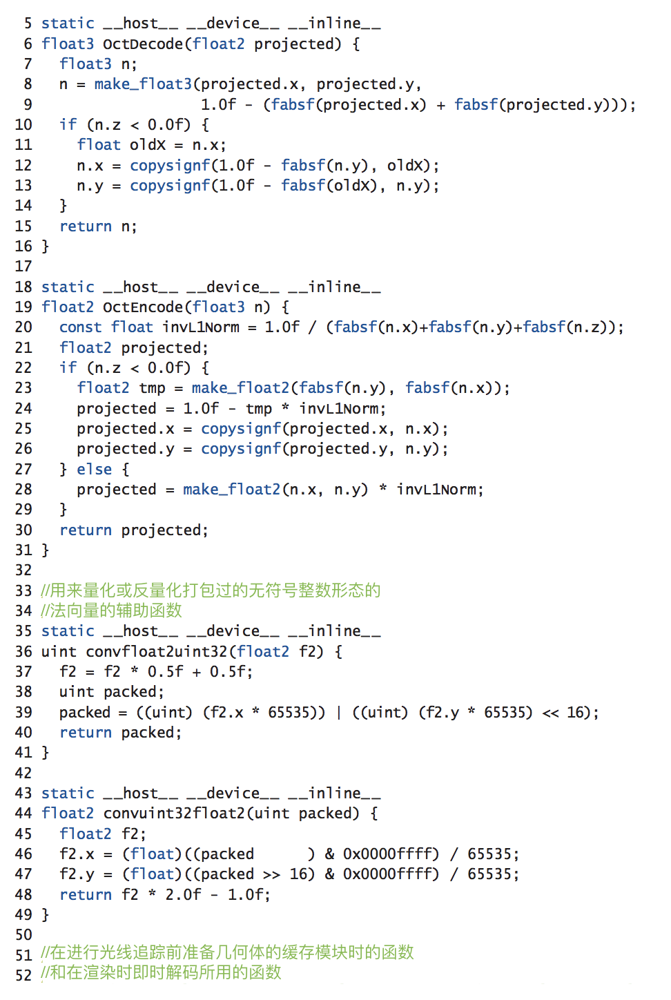
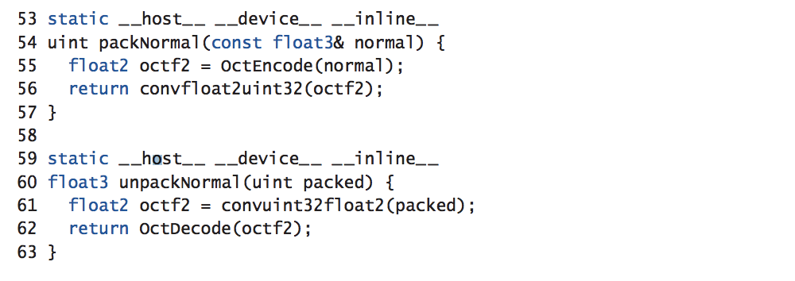

## 第27章. 基于Hi-Fi 科学可视化的交互式光线追踪技术

### 摘要

本章描述了在交互式科学可视化中的渲染技术及实现手法。光线追踪技术为构建Hi-Fi渲染引擎提供了一个方便的框架，使该引擎可以直接合成可发布质量的科技文稿图像，并同时提供高交互度的渲染体验，达到真正的"所见即所得"。这种交互性及渲染复杂性的融合使得非计算机图像方向或对渲染技术并不了解的科学家们也能够即时将先进的渲染技术使用到他们的日常科研当中。本章将总结光线追踪技术应用在科学可视化，特别是分子可视化中的实用技巧。

### 27.1 简介

科学可视化被用来说明复杂的数据、概念和物理现象，从而辅助假说推进、问题发掘、协助合作及决策告知。这些可视化场景用图像展示了研究中的关键结构和机能的细节，以及他们之间的联系，或者是复杂的研究过程的动态情况。高质量的光线追踪技术已经被广泛使用于建造复杂的场景。交互性是提高科学可视化效率的一大帮手，因为它使得可视化用户可以快速地浏览及操控数据、模型和图像显示，从而获得灵感并且有助于用户确认或否决他们提出的假设。

在构建简单易懂的可视化工具时我们也会遇到一些挑战，包括如何权衡哪些内容需要被详细地展示，哪些内容只需要展示重要部分，哪些内容需要被剔除（通常来说是不得已地牺牲）来确保视觉传达的准确性。高级的渲染技术为这些问题提供了许多不同的解决方案。光线追踪可以相对轻便地合并高级的光线和阴影模型，并且支持多种几何图形和数据类型。因此，光线追踪是科学技术可视化中用来渲染复杂的几何场景的有力工具。

尽管光线追踪已经在离线可视化或批量处理的基础可视化中被运用多年，直到最近，光线追踪才逐渐在以互动性视为核心，基于光栅化的方法中崭露头角。高性能的硬件优化光线追踪框架的开发，和最近在商用GPU中针对光线追踪的硬件加速技术都为广泛使用基于科学可视化的交互式光线追踪提供了必要的条件。ParaView，VisIt，Visual Molecular Dynamics（VMD），及Visualization ToolKit（VTK）是最为高性能计算中被广泛应用的科学可视化工具。他们都已经在过去几年中增加了交互式光线追踪的功能。最近，随着针对于光线追踪的硬件加速技术带来的性能提升，我们将有更多机会在常规的科学和技术可视化中应用交互式光线追踪技术。

下文中的讨论及代码范例旨在记录一些想法、实用技术、及通过在VMD（一种被广泛使用的分子可视化工具）中开发整合三种交互式光线追踪引擎所带来的一些前景展望。

### 27.2 光线追踪在大场景中面临的挑战

在科学可视化中反复出现的一个问题就是渲染一些突破物理内存极限的场景的必要性。基于光栅化的可视化方法得利于其流媒体性质和低内存需求，但是光线追踪的方法，恰恰相反，需要将整个场景的细节都存储起来，随时提供引擎所需。这是光线追踪方法能灵活地、优雅地、通融地解决多种渲染和可视化问题所需要付出的主要代价。

在撰写本文时，GPU在保卫层次（BVH）遍历和射线-三角形交叉测试方面精妙的硬件加速已经大大提高了光线追踪的表现。这种硬件优化将光线追踪提升到另一个层次，即在处理低成本着色的科学可视化场景时，内存带宽目前，并在可见的将来有可能仍旧，是限制光线追踪效果上限的一个重要原因。综合以上这些考虑，我们清楚地知道，能否在有挑战性的科学可视化场景中长期运用光线追踪技术，将取决于我们能否开发出能有效利用内存容量及内存带宽的应用。

#### 27.2.1 使用合理的几何图元

一些节省内存空间和内存带宽的绝佳方案都和构建可视化的几何图元的选择有关。打个比方，一个球体的位置和半径只占用4个浮点的内存，但是一个不共用顶点的三角形需要存储每个顶点的法向量，因此需要18个浮点的内存。当我们表现一个三角形网格时，共用的顶点可以通过顶点索引悉数列出（每个三角形有三个索引）。如果可行的话，另一种更好的方法是通过三角形条带的顶点排序来存储三角形信息（第一个三角形有三个顶点，往后每增加一个三角形，只需要增加一个顶点）。如此一来，通过量化或者压缩表面法向量，他们的记忆成本就会大大降低，由此也可以进一步降低每个顶点和每个三角形的内存。最终，当这些相关技术可以大大降低三角形网格的存储成本时，直接光线追踪球形、圆柱形或者锥体，或许比追踪小的三角形网格消耗更少的内存带宽。尽管在一些领域，比如分子可视化中，我们确信使用特定的几何图元来实现光线追踪可以大大降低存储成本，在另外的一些领域中却不是这样：可纳入考虑的几何图元或许会在光线追踪的射线-图元相交测试中造成数据精确性或者收敛性上的问题，或者因为其性能属性的异常而使得其无法被有效利用于所有案例中。

#### 27.2.2 消除冗余，压缩，及量化

在我们抉择出最好的几何图元之后，剩下的能够降低存储空间和内存带宽的低成本方法就都和消除大批几何图元中产生的大量高级重复有关了。比如说，用来可视化液体流动、磁力场或者静电势场的量子平流流线就包含数以万计的线段。在画管状流线时，如果所有细分线段都有拥有同样的半径，为什么我们还要给每个圆柱体（或球体）都储存一个半径呢？因为光栅化管线处理各种三角形网格形式和预处理顶点数据的方式大同小异，光线追踪引擎通过这些类似的机动性获益，但却可以服务于范围更广的潜在几何图元。打个比方，一个被用来渲染包含大量不同类型流线的光线追踪引擎可能运用了许多特殊的几何数据，例如每个圆柱和球体的特定半径、所有细分圆柱和球体的常量半径。根据底层光线追踪框架的可编程性，我们或许可以让圆柱和球体图元分享相同的顶点数据。另外，我们或许可以实现一个完全定制化的流线渲染图元来实现或模拟高速划过的球体经过一段由原始流线顶点定义的，或是由电脑控制的能拟合原始数据的空间曲线。光线追踪框架的可编程性越强，应用程序就能越轻易地选择几何图元和集合批次方法来更好地解决大型可视化中出现的内存容量问题和性能问题。

在高级重复性因大批次几何图形被编译化及参数化而消除后，我们的下一个技术需求是消除邻近组别的几何图形或相互关联的几何特性中区域性的数据重复。我们通常可以通过压缩数据和降低几何属性的量化精确度的方法来减小区域性数据的体量。当使用量化或者其他有损精确度的压缩手段时，具体的容错量是根据可视化问题的细节因事制宜的。压缩容量数据、标量场和张量（例如ZFP库[8,9]中提供的），和量化表面法向量数据（例如八面体的法向量编码[4, 12]）是两个有代表性的技术范例。在列表27-4中可以看到使用八面体法向量编码来实现法向量包装和拆包的案例。

**列表27-1.** *这段代码例举了使用八面体法向量编码来实现法向量包装和拆包的主要函数。这种例式可以在由三个独立浮点值表示的法向量和由一个32位无符号的整数编码表示的法向量间来回转换。这个例式还有很多性能优化和提升的空间，但已经可以被简单地运用在你自己的光线追踪引擎里了。*

图27-1所示的分子结构的原子细节是上述所有技术的综合展现。这个可视化图的实现用到了三角形网格和定制几何图元，加入在几何编码及批量处理中消除重复数据的技术和八面体法向量的转换。下面这个应用到八面体法向量编码的例子可以展示这个技术在交互式光线追踪当中的应用和价值。在做射线-三角形的交叉测试时，我们不需要顶点法线的信息。只有在最靠近的交叉点已经被找到并确认需要被着色时我们才会去参照法线数据。因此，在着色时的即时反转量化或者解压成本很低，而且在大型复杂的交互式光线追踪场景中，这个成本对帧率的影响微乎其微，但所带来的内存节省却是极为可观的。相似的方法也可以运用在预处理顶点的颜色和其他属性上面，可能会带来更大的影响。

**图27-1.** *这是极近距离的光合色谱结构中的脂质模的原子细节模型可视化。这个模型的内容部分由三角形网格结构表示，使用了八面体法向量数据结构。这个脂质模模型中的原子细节由成千上万的球体和柱体组成。因为使用直接光线追踪定制的球体和柱体数组，这个模型的内存量大大减小，因此让这个巨大模型结构的交互式光线追踪成为可能，并也同时确保了在商用GPU上的高性能。*

#### 27.2.3 关于光线追踪加速结构的考量

除了一个几何图元的必要内存成本，考虑BVH或者其他光线追踪加速结构中每个基元的内存消耗也很重要。令人惊讶的是，尽管我们在最先进的光线追踪加速结构中已经使用了数据压缩技术，这些加速结构的体量有时会和他们编码的几何场景一样大，甚至更大。因此，加速结构和他们的时间-空间取舍是科学可视化应用中一个重要的问题。因为加速结构的构建、存储和遍历都会对光线追踪的性能造成严重的影响，他们常常是场景专有的、高度硬件优化的，也因此比我们所希望的要不灵活许多。

在可视化静态结构时，因为构建和更新成本相对较小，大量高度优化的加速结构可以产生出最好的效果。但在交互性地展示例如模拟轨道这种时间序列数据时，花费在几何缓存更新和加速结构（重）构建上的时间就变成了一个影响交互性的大因素。时间序列动画太过于复杂，以至于很难从增加并发处理，例如多线程技术中显著获益。为了能完全将几何更新和加速结构（重）构建从正在发生的交互性渲染和显示中分离开来，对重要的光线追踪数据结构施以双重或者多重缓存是相当必要的。对光线追踪数据进行多重缓存可以确保场景更新和即时渲染可以同步或者异步进行。

光线追踪加速系统优化的灵活性对于大型静态场景和动态时间序列可视化来说都非常重要。当我们可视化拥有极为复杂的几何结构的大型科学场景时，加速结构所需的内存量往往会超出可用范围。在这种情况下，我们通常会偏向于去搭建一个相对粗糙的加速结构，舍弃一部分性能来增加几何容量。使用粗糙的加速结构对于时间序列可视化来说也是一个理想的取舍。因此，有些现有的光线追踪框架启发性和可调性地提供了对加速系统的简单控制。这也为我们将来大大改善光线追踪引擎留下了一个巨大的发展空间。

